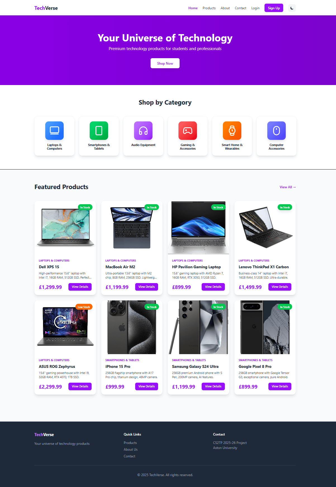
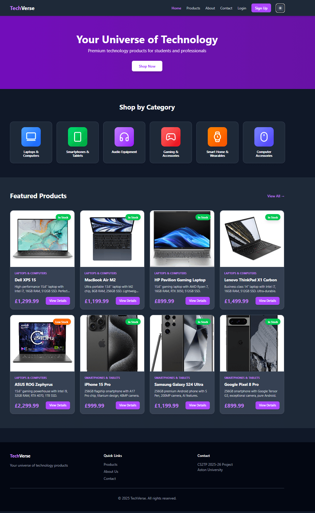
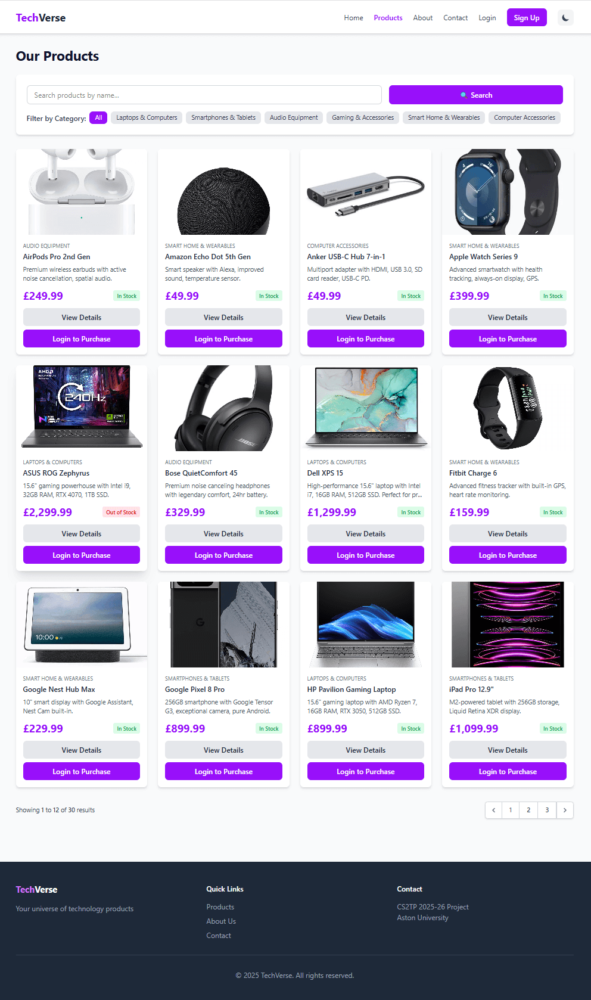
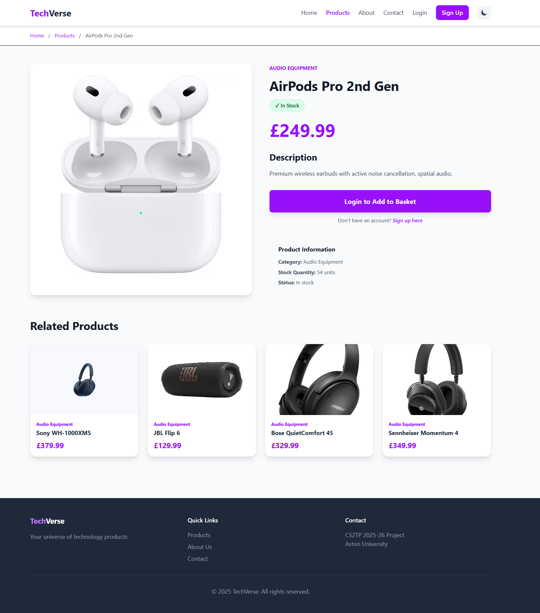
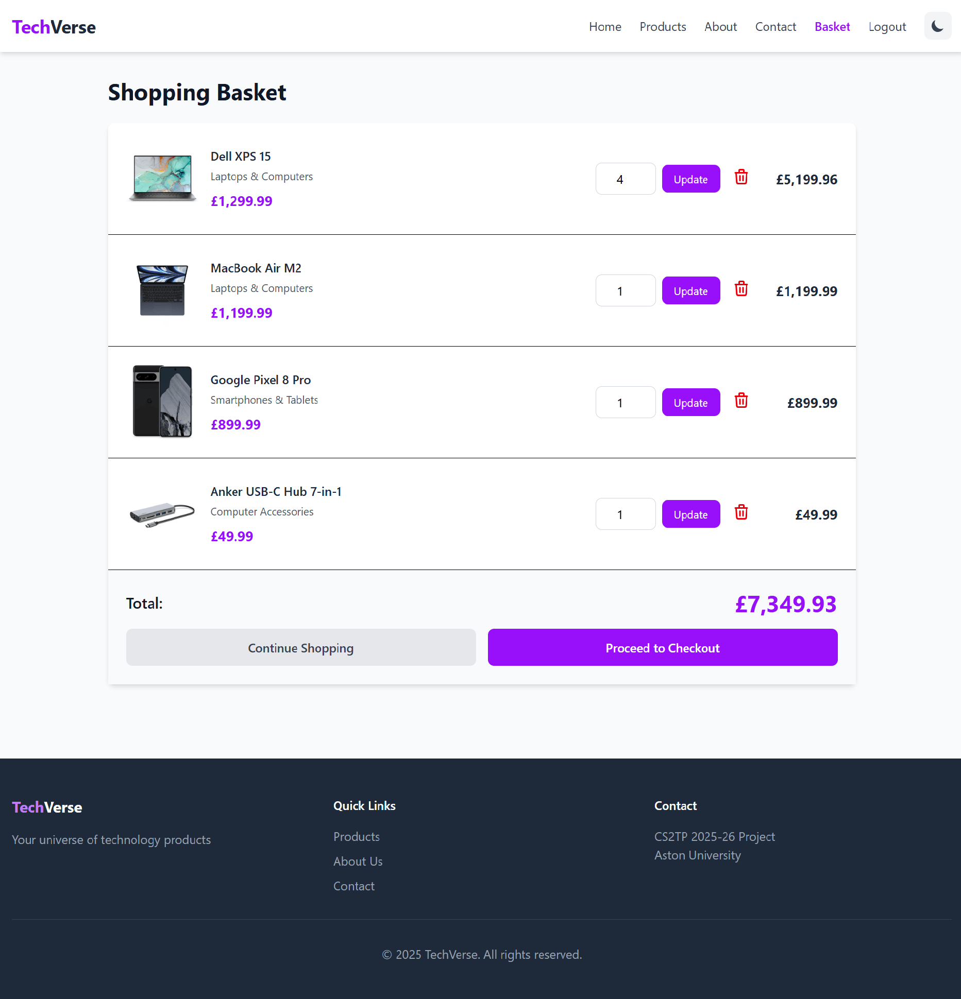
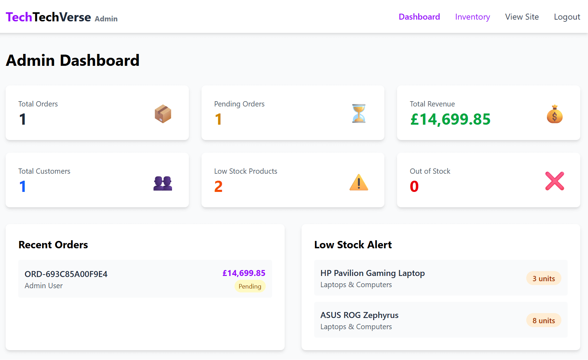

# 🚀 TechVerse - Your Universe of Technology


> **CS2TP 2025-26 E-Commerce Platform Project**  
> A modern, full-featured e-commerce platform for selling premium technology products.

---

## 📋 About

**TechVerse** is a comprehensive e-commerce platform built with Laravel, designed to provide students and professionals with access to cutting-edge technology products at competitive prices.

### 🎯 Our Vision
To democratize access to technology by offering an intuitive, secure, and feature-rich online shopping experience.

### 🎉 **MVP Status - December 2025**
✅ **Demo Complete!** Core e-commerce functionality delivered  
✅ **Live Deployment:** cs2team69.cs2410-web01pvm.aston.ac.uk  
✅ **30 Products** across 6 categories with real images  
✅ **Full User Journey:** Browse → Basket → Checkout → Admin  
✅ **Dark Mode:** Fully functional with localStorage persistence  
✅ **Team Collaboration:** 19+ merged pull requests, 7 contributors  

### 🎨 Business Identity
- **Name**: TechVerse  
- **Tagline**: "Your Universe of Technology"  
- **Target Audience**: University students, young professionals (18-35), tech enthusiasts  
- **Product Range**: 30+ products across 6 categories

---

## ✨ Key Features

### For Customers 🛒
- ✅ User registration & secure login **(LIVE)**
- ✅ Browse products by category **(LIVE)**
- ✅ Advanced search & filtering by name and category **(LIVE)**
- ✅ Shopping basket management **(LIVE)**
- ✅ Secure checkout process **(LIVE)**
- ✅ Dark mode toggle with persistence **(LIVE)**
- ✅ Product images and stock badges **(LIVE)**
- ✅ Category icons (laptop, phone, headphones, gamepad, watch, mouse) **(LIVE)**
- 🔄 Order history & tracking **(In Progress)**
- ⏳ Product reviews & ratings **(Planned)**
- ⏳ Profile management **(Planned)**
- ⏳ Wishlist functionality **(Planned)**
- ⏳ Product return requests **(Planned)**

### For Administrators 👨‍💼
- ✅ Comprehensive admin dashboard **(LIVE)**
- ✅ Real-time inventory management **(LIVE)**
- ✅ Order processing **(LIVE)**
- ✅ Sales analytics **(LIVE - £1,649.91 revenue)**
- ✅ Product management interface **(LIVE)**
- 🔄 Customer account management **(In Progress)**
- ⏳ Automatic low-stock alerts **(Planned)**
- ⏳ Stock movement tracking **(Planned)**

### Future Features 🚀
- ⏳ Payment Gateway Integration (Stripe/PayPal)
- ⏳ Email Notifications System
- ⏳ AI-Powered Customer Chatbot
- ⏳ Product Reviews & Ratings
- ⏳ Wishlist Functionality
- ⏳ Order Tracking System
- ⏳ Live Customer Support Chat
- ⏳ Advanced Search Filters (price range, brand)
- ⏳ Service Feedback System

**Legend:**  
✅ Complete & Live | 🔄 In Progress | ⏳ Planned for Phase 2
---

## 📸 Platform Overview

Explore TechVerse's user interface and key features through these screenshots.

### 🏠 Homepage - Light & Dark Mode

Our homepage features a clean, modern design with easy navigation and instant dark mode switching.

<div align="center">
  
  <p><em>Homepage in Light Mode - Showcasing 6 product categories with icons and featured products</em></p>
</div>

<div align="center">
  
  <p><em>Homepage in Dark Mode - Persistent theme preference using localStorage</em></p>
</div>

---

### 📦 Product Catalog

Browse our extensive collection of 30 real technology products across 6 categories.

<div align="center">
  
  <p><em>Product grid showing laptops, smartphones, audio equipment, gaming accessories, wearables, and computer accessories</em></p>
</div>

---

### 🛍️ Product Details & Shopping

Detailed product pages with comprehensive information and seamless basket management.

<div align="center">
  
  <p><em>Product detail page with full specifications, pricing, and add to basket functionality</em></p>
</div>

<div align="center">
  
  <p><em>Dynamic shopping basket with quantity controls, live total calculation, and checkout options</em></p>
</div>

---

### 💼 Admin Dashboard

Comprehensive admin panel with real-time analytics and inventory management.

<div align="center">
  
  <p><em>Admin dashboard showing £1,649.91 in revenue, order management, inventory tracking, and sales analytics</em></p>
</div>

---

### 📱 Responsive Design

Fully optimized for mobile devices with a responsive, touch-friendly interface.

<div align="center">
  
  <p><em>Mobile view showing responsive layout and touch-optimized navigation</em></p>
</div>

---

---

## 🛠️ Tech Stack

| Layer | Technology |
|-------|------------|
| **Backend** | Laravel 12.x (PHP 8.3+) |
| **Frontend** | Blade, Tailwind CSS 4.0, Alpine.js |
| **Database** | SQLite (Development), MySQL 8.0 (Production) |
| **Version Control** | Git & GitHub |
| **Package Manager** | Composer, NPM |
| **Deployment** | Aston University Web Server |

---

## 🌐 **Live Demo**

**🔗 Production Site:** [http://cs2team69.cs2410-web01pvm.aston.ac.uk](http://cs2team69.cs2410-web01pvm.aston.ac.uk)

**Test Accounts:**

**Admin Access:**
```
Email: admin@techverse.com
Password: Admin123!
```

**Customer Access:**
```
Email: customer@test.com
Password: Customer123!
```

⚠️ **Note:** This is a demo site for academic purposes. Please do not use real payment information.

---

## 📦 Product Categories

1. **💻 Laptops & Computers** - High-performance devices
2. **📱 Smartphones & Tablets** - Latest mobile technology  
3. **🎧 Audio Equipment** - Premium sound devices
4. **🎮 Gaming & Accessories** - Gaming gear & peripherals
5. **⌚ Smart Home & Wearables** - IoT & fitness devices
6. **🖥️ Computer Accessories** - Monitors, keyboards, storage

---

## 🚀 Quick Start

### Prerequisites
- PHP 8.3 or higher
- Composer
- Node.js & NPM
- MySQL 8.0+ (or SQLite for development)
- Git

### Installation

```bash
# 1. Clone the repository
git clone https://github.com/saeed-moo/TechVerse.git
cd TechVerse

# 2. Install dependencies
composer install
npm install

# 3. Environment setup
cp .env.example .env
php artisan key:generate

# 4. Configure database in .env file
# For SQLite (Development):
DB_CONNECTION=sqlite

# For MySQL (Production):
DB_CONNECTION=mysql
DB_DATABASE=techverse
DB_USERNAME=your_username
DB_PASSWORD=your_password

# 5. Create database (MySQL only)
mysql -u root -p
CREATE DATABASE techverse;
exit;

# 6. Run migrations and seeders
php artisan migrate --seed

# 7. Link storage
php artisan storage:link

# 8. Build assets
npm run build

# 9. Start development server
php artisan serve
```

Visit: `http://localhost:8000` 🎉

### Test Accounts

**Admin Access:**
```
Email: admin@techverse.com
Password: Admin123!
```

**Customer Access:**
```
Email: customer@test.com
Password: Customer123!
```

⚠️ **Change these passwords in production!**

---

## 🚀 **Deployment**

### **Production Environment**

**Server:** Aston University Web Server  
**URL:** http://cs2team69.cs2410-web01pvm.aston.ac.uk  
**Status:** ✅ Live  
**Database:** SQLite (production configured)

### **Deployment Process**

```bash
# 1. SSH into server
ssh cs2team69@cs2410-web01pvm.aston.ac.uk

# 2. Navigate to project
cd ~/laravel

# 3. Pull latest changes
git pull origin main

# 4. Install dependencies
composer install --no-dev --optimize-autoloader
npm install --production

# 5. Compile assets
npm run build

# 6. Run migrations
php artisan migrate --force

# 7. Clear all caches
php artisan optimize:clear
php artisan view:clear
php artisan config:clear
php artisan route:clear

# 8. Set permissions
chmod -R 755 public/images
chmod -R 755 public/build
chmod -R 755 storage
```

### **Environment Configuration**

Key production settings in `.env`:
```env
APP_ENV=production
APP_DEBUG=false
APP_URL=http://cs2team69.cs2410-web01pvm.aston.ac.uk
DB_CONNECTION=sqlite
ASSET_URL=http://cs2team69.cs2410-web01pvm.aston.ac.uk
```

### **Important Notes:**
- ✅ Vite assets compiled to `/public/build/`
- ✅ Product images in `/public/images/products/`
- ✅ Dark mode using Tailwind CSS v4 with class-based strategy
- ✅ All 30 product images uploaded and optimized

---

## 👥 Team

| Name | Role | GitHub | Email |
|------|------|--------|-------|
| **Saeed Moosivand** | Project Lead & Full-Stack Developer | [@saeed-moo](https://github.com/saeed-moo) | 240169451@aston.ac.uk |
| **Ana Ciobanu** | Frontend Developer | [@aion-maria](https://github.com/aion-maria) | 220103129@aston.ac.uk |
| **Natalia Aghedo** | Backend Developer | [@NataliaAghedo-1](https://github.com/NataliaAghedo-1) | 240006237@aston.ac.uk |
| **Umm Salma Hamisu** | Database Specialist & Feature Developer | [@UmmSalmaHamisu](https://github.com/UmmSalmaHamisu) | 240132950@aston.ac.uk |
| **Mandeep Singh** | QA Engineer & Tester | [@MandeepSingh](https://github.com/MandeepSingh) | 230107629@aston.ac.uk |
| **Isaac Yeboah** | DevOps & Deployment | [@Notisaac07](https://github.com/Notisaac07) | 240159991@aston.ac.uk |
| **Majdi Alkayed** | Feature Developer | [@Whitewolf2001](https://github.com/Whitewolf2001) | majdialkayed19@gmail.com |

### Team Roles & Responsibilities

**Saeed Moosivand** - *Project Lead & Full-Stack Developer*
- Overall project architecture and design (frontend + backend integration)
- Implemented dark mode toggle with Tailwind CSS v4
- Developed product image system and category icons
- Production deployment and server configuration
- Code reviews and quality assurance
- Sprint planning coordination and Trello task management
- GitHub repository management and branch protection setup
- Final presentation and demo delivery

**Ana Ciobanu** - *Frontend Developer*
- UI/UX design and implementation
- Blade template development for all customer-facing pages
- Tailwind CSS styling and responsive design
- Homepage layout with category cards and featured products
- Product catalog and detail pages
- Mobile-first responsive design

**Natalia Aghedo** - *Backend Developer*
- Controllers and routing implementation
- Business logic for order processing
- Authentication middleware
- API development for admin dashboard
- Backend validation and error handling

**Umm Salma Hamisu** - *Database Specialist & Feature Developer*
- Database schema design and ER diagram (11 tables)
- Migrations and seeders for all database tables
- Data integrity, relationships, and foreign key constraints
- Query optimization and database performance
- **Transitioning to feature development:** Product Reviews, Wishlist, Order Tracking

**Mandeep Singh** - *QA Engineer & Tester*
- Manual testing procedures across all features
- Cross-browser testing (Chrome, Firefox, Safari, Edge)
- Mobile device testing
- Bug tracking and reporting via GitHub Issues
- Quality assurance standards enforcement
- User acceptance testing coordination

**Isaac Yeboah** - *DevOps & Deployment*
- Server setup and SSH configuration
- Production deployment to Aston university server
- Environment management and .env configuration
- Asset compilation and optimization
- File permissions and security settings
- Documentation maintenance

**Majdi Alkayed** - *Feature Developer*
- Admin dashboard development
- Order management interface
- Sales analytics and reporting features
- Inventory management functionality
- Backend integration for admin features
- Feature testing and bug fixes

---

## 📂 Project Structure

```
TechVerse/
├── app/
│   ├── Http/
│   │   ├── Controllers/         # Application controllers
│   │   │   ├── Admin/          # Admin dashboard controllers
│   │   │   ├── Auth/           # Authentication controllers
│   │   │   ├── Customer/       # Customer area controllers
│   │   │   ├── AboutController.php
│   │   │   ├── ContactController.php
│   │   │   └── HomeController.php
│   │   └── Middleware/         # Custom middleware
│   ├── Models/                 # Eloquent models
│   │   ├── Basket.php
│   │   ├── Category.php
│   │   ├── Order.php
│   │   ├── OrderItem.php
│   │   ├── Product.php
│   │   ├── Review.php
│   │   └── ...
│   └── Services/               # Business logic services
├── database/
│   ├── migrations/             # Database schema (11 tables)
│   └── seeders/                # Sample data (30 products, 6 categories)
├── resources/
│   ├── views/                  # Blade templates
│   │   ├── admin/             # Admin dashboard views
│   │   ├── customer/          # Customer area views
│   │   ├── products/          # Product pages
│   │   ├── checkout/          # Checkout flow
│   │   ├── orders/            # Order management
│   │   └── layouts/           # Layout templates
│   ├── css/
│   │   └── app.css            # Tailwind CSS v4
│   └── js/
│       └── app.js             # JavaScript & Alpine.js
├── routes/
│   └── web.php                # Application routes
├── public/
│   ├── build/                 # Compiled assets (CSS, JS)
│   └── images/
│       └── products/          # 30 product images
└── tests/                     # Automated tests
```

---

## 🔄 Development Workflow

### Git Branching Strategy
- `main` - Production code (protected, requires PR approval)
- `develop` - Integration branch
- `feature/*` - New features
- `bugfix/*` - Bug fixes
- `hotfix/*` - Emergency fixes

### Branch Protection Rules
- ✅ Main branch requires pull request approval
- ✅ Admin can bypass for urgent fixes
- ✅ All team members must use PRs for collaboration
- ✅ 19+ pull requests successfully merged

### Creating a Feature

```bash
# 1. Start from main (or develop)
git checkout main
git pull origin main

# 2. Create feature branch
git checkout -b feature/your-feature-name

# 3. Make changes and commit
git add .
git commit -m "feat: add your feature description"

# 4. Push to GitHub
git push origin feature/your-feature-name

# 5. Create Pull Request on GitHub
# 6. Wait for review and approval
# 7. Merge to main
```

### Commit Convention
```
feat: Add new feature
fix: Fix a bug
docs: Update documentation
style: Code formatting
refactor: Code refactoring
test: Add tests
chore: Maintenance tasks
```

---

## 🧪 Testing

```bash
# Run all tests
php artisan test

# Run specific test suite
php artisan test --testsuite=Feature

# Run with coverage
php artisan test --coverage

# Run specific test file
php artisan test tests/Feature/ProductTest.php
```

### Testing Coverage
- ✅ Manual testing complete for all MVP features
- ✅ Cross-browser testing (Chrome, Firefox, Safari, Edge)
- ✅ Mobile responsive testing
- ⏳ Automated unit tests (planned for Phase 2)
- ⏳ Integration tests (planned for Phase 2)

---

## 📚 Documentation

- **[Installation Guide](docs/INSTALLATION.md)** - Detailed setup instructions
- **[Contributing Guidelines](CONTRIBUTING.md)** - How to contribute
- **[Team Setup](docs/TEAM_SETUP.md)** - Onboarding guide
- **[API Documentation](docs/API.md)** - API reference
- **[Deployment Guide](docs/DEPLOYMENT.md)** - Production deployment

---

## 🔐 Security

We implement multiple security layers:
- ✅ Password hashing (Bcrypt)
- ✅ CSRF protection on all forms
- ✅ SQL injection prevention (Eloquent ORM)
- ✅ XSS protection (Blade escaping)
- ✅ Input validation & sanitization
- ✅ Role-based access control (Admin/Customer)
- ✅ Secure authentication with Laravel Breeze
- ✅ Environment variable protection

**Found a security issue?** Email: 240169451@aston.ac.uk  
(Please don't create public issues for security vulnerabilities)

---

## 📊 Current Status

### ✅ **Sprint 1-3 (MVP Phase) - COMPLETE!**
- [x] Project setup & initialization
- [x] Team onboarding & Git workflow
- [x] Database schema design (11 tables)
- [x] User authentication system
- [x] Product catalog (30 products, 6 categories)
- [x] Category icons with gradients
- [x] Shopping basket functionality
- [x] Order processing system
- [x] Checkout flow (dummy payment)
- [x] Admin dashboard with analytics
- [x] Dark mode implementation (Tailwind v4)
- [x] Product images (all 30 uploaded)
- [x] Production deployment
- [x] **Demo presentation complete!**

### 🎯 **Sprint 4-8 (Enhancement Phase) - PLANNED**

#### **Phase 2: Core Enhancements (January-February 2026)**
- [ ] Payment Gateway Integration (Stripe/PayPal)
- [ ] Email Notifications System
- [ ] Product Reviews & Ratings
- [ ] Wishlist Functionality
- [ ] Advanced Search Filters (price range, brand)
- [ ] Order Tracking System

#### **Phase 3: Advanced Features (March-April 2026)**
- [ ] Customer Support Chat (real-time)
- [ ] AI Chatbot Assistant
- [ ] Service Feedback System
- [ ] Analytics Dashboard Enhancement
- [ ] Product Return Management
- [ ] Inventory Movement Tracking

#### **Phase 4: Testing & Optimization (May 2026)**
- [ ] Backend Unit Testing (PHPUnit)
- [ ] Automated Testing Suite
- [ ] Performance Optimization
- [ ] Security Audit
- [ ] Code Coverage (80%+ target)
- [ ] Final Documentation

---

## 📈 **Project Metrics**

| Metric | Value |
|--------|-------|
| **Products** | 30 |
| **Categories** | 6 |
| **Database Tables** | 11 |
| **Team Members** | 7 |
| **GitHub PRs Merged** | 19+ |
| **Lines of Code Added** | 5,450+ |
| **Lines of Code Removed** | 874 |
| **Demo Status** | ✅ Complete |
| **Production Deployment** | ✅ Live |
| **Sample Revenue** | £1,649.91 |
| **Product Images** | 30 (all optimized) |
| **Development Time** | 12 weeks |

---

## 🤝 Contributing

We welcome contributions from all team members! Please read our [Contributing Guidelines](CONTRIBUTING.md) before getting started.

### Quick Contribution Steps:
1. Fork the repository
2. Create your feature branch (`git checkout -b feature/AmazingFeature`)
3. Commit your changes (`git commit -m 'feat: add some AmazingFeature'`)
4. Push to the branch (`git push origin feature/AmazingFeature`)
5. Create a Pull Request
6. Wait for code review and approval
7. Merge to main after approval

### Code Review Process
- All code must be reviewed by at least one team member
- Admin (Saeed) can bypass for urgent fixes
- Use GitHub's review features for comments and suggestions
- Address all review comments before merging

---

## 📞 Contact

**Project Lead**: Saeed Moosivand  
📧 Email: 240169451@aston.ac.uk  
🐙 GitHub: [@saeed-moo](https://github.com/saeed-moo)

**Project Links:**
- 🔗 Repository: https://github.com/saeed-moo/TechVerse
- 🌐 Live Site: http://cs2team69.cs2410-web01pvm.aston.ac.uk
- 📋 Trello Board: TechVerse - Team 69
- 💬 Team Communication: Microsoft Teams

---

## 📄 License

This project is developed for educational purposes as part of CS2TP coursework at Aston University.

**Academic Integrity Statement:**  
This project was developed with minimal use of Generative AI tools, in compliance with university guidelines. All code represents original work by our team, with AI assistance limited to debugging, syntax checking, and documentation formatting.

---

## 🙏 Acknowledgments

- **CS2TP Module Team** - Course structure, guidance, and support
- **Aston University** - Server infrastructure and resources
- **Laravel Community** - Excellent framework and comprehensive documentation
- **Tailwind CSS Team** - Modern utility-first CSS framework
- **Open Source Contributors** - Various packages and tools used in this project
- **Our Team** - Dedication, collaboration, and hard work throughout the project

---

## 🌟 Show Your Support

If you find this project helpful, please ⭐ star this repository!

---

## 🔮 Future Vision

**TechVerse aims to become a comprehensive e-commerce platform with:**
- 🤖 AI-powered product recommendations
- 📧 Automated email marketing
- 💳 Full payment processing
- 📦 Real-time order tracking
- ⭐ Community-driven reviews
- 💬 24/7 customer support
- 📊 Advanced analytics for business insights
- 🌍 Multi-language support
- 📱 Native mobile apps (iOS & Android)

---

<div align="center">

**Made with ❤️ by the TechVerse Team**


**🚀 Building the Future of Tech E-Commerce 🚀**

[Live Demo](http://cs2team69.cs2410-web01pvm.aston.ac.uk) • [Documentation](docs/) • [Report Issue](https://github.com/saeed-moo/TechVerse/issues)

</div>

---

**Last Updated**: December 2025  
**Version**: 1.0.0 (MVP)  
**Status**: ✅ MVP Complete | 🚀 Enhancements Planned

---

## 🎓 **Academic Project Information**

**Course**: CS2TP - Team Project  
**Institution**: Aston University  
**Academic Year**: 2025-2026  
**Team**: Team 69  
**Project Duration**: 12 weeks (October - December 2025)  

**Key Deliverables:**
- ✅ Project proposal and planning
- ✅ Database design (ER diagram, 11 tables)
- ✅ Website sitemap (31 pages)
- ✅ Wireframes (5 key pages)
- ✅ UI mockups (5 pages with full design system)
- ✅ MVP implementation (30 products, full e-commerce flow)
- ✅ Live deployment on university server
- ✅ Final presentation and demo
- ✅ Team collaboration via Git (19+ merged PRs)
- ✅ Documentation (README, code comments, project structure)

**Assessment Criteria Met:**
- ✅ Functionality: Complete e-commerce system with admin panel
- ✅ Design: Professional UI with dark mode and responsive layout
- ✅ Database: Well-structured schema with proper relationships
- ✅ Teamwork: Clear roles, collaborative Git workflow, regular meetings
- ✅ Documentation: Comprehensive README, code comments, deployment guide
- ✅ Presentation: Live demo showcasing all features

---

**🎉 Thank you for checking out TechVerse! 🎉**
