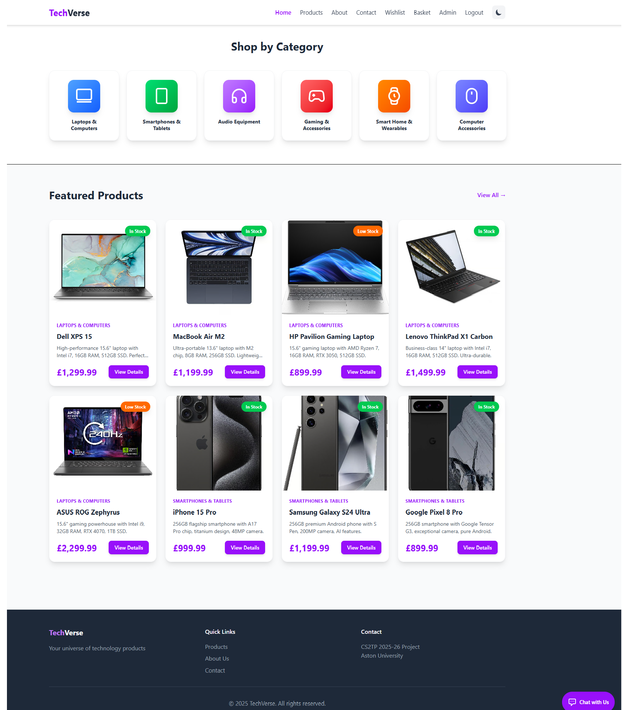
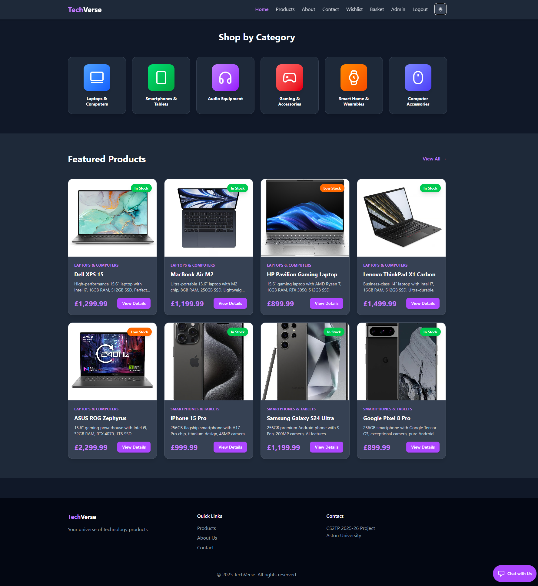
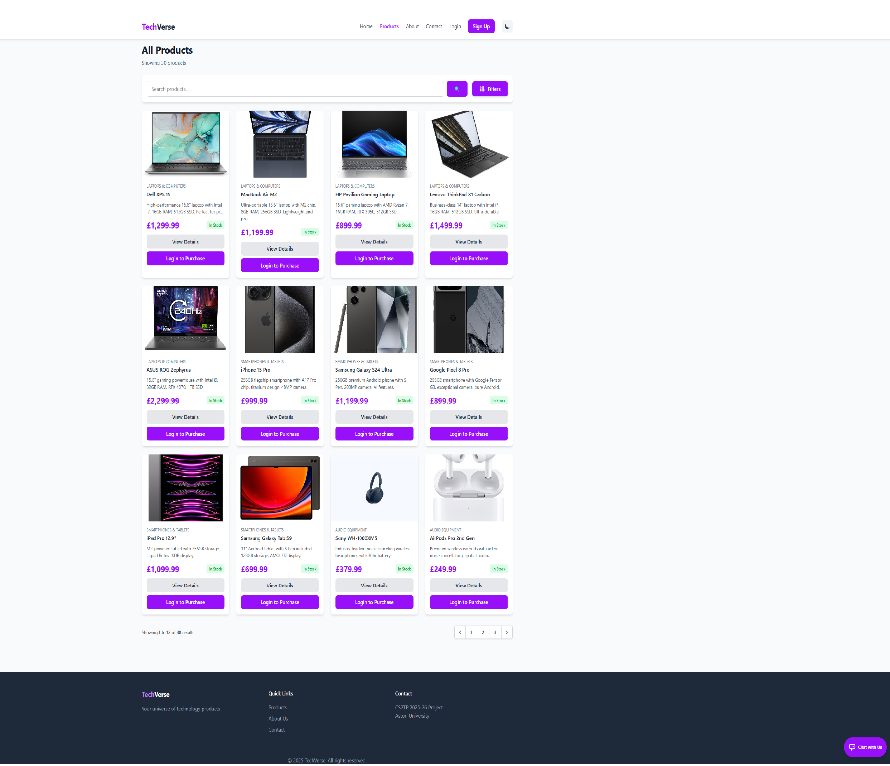
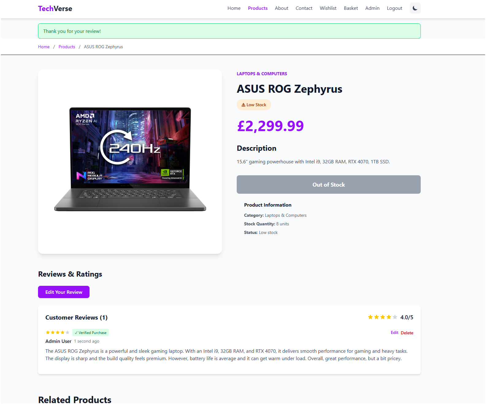
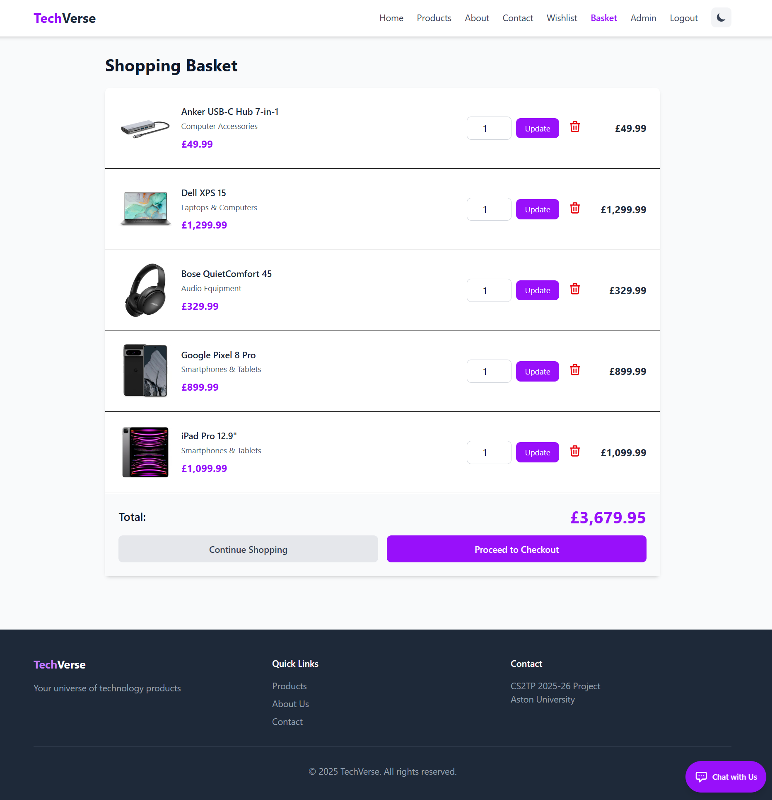
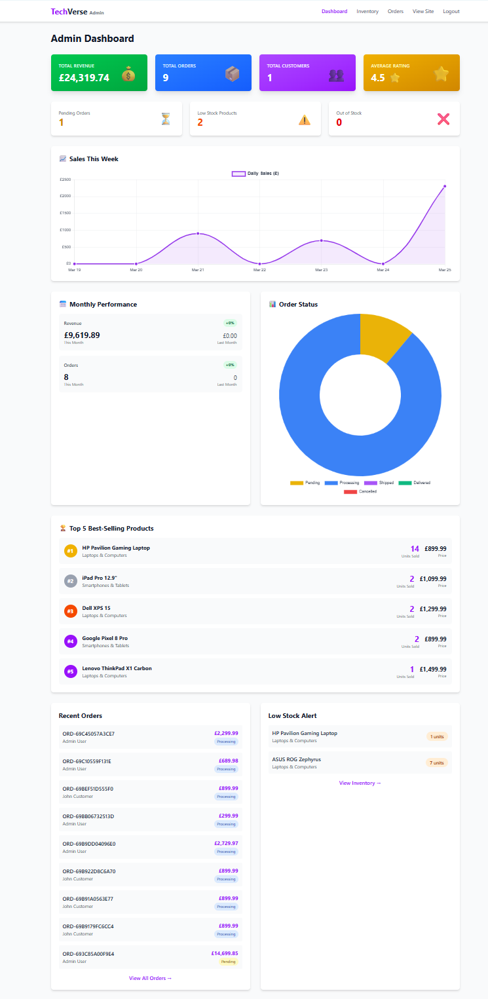
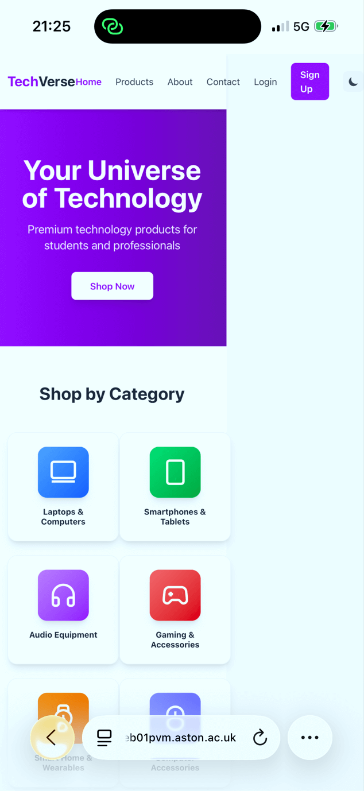

# 🚀 TechVerse - Your Universe of Technology


> **CS2TP 2025-26 E-Commerce Platform Project**
> A modern, full-featured e-commerce platform for selling premium technology products.

---

## 📋 About

**TechVerse** is a comprehensive e-commerce platform built with Laravel, designed to provide students and professionals with access to cutting-edge technology products at competitive prices.

### 🎯 Our Vision

To democratize access to technology by offering an intuitive, secure, and feature-rich online shopping experience.

### 🎉 **Phase 5 Status - March 2026**

- ✅ **Phase 5 Complete!** Advanced features and final polish delivered
- ✅ **Live Deployment:** cs2team69.cs2410-web01pvm.aston.ac.uk
-  ✅ **30 Products** across 6 categories with real images
- ✅ **AI-Powered:** Gemini 2.5 Flash chatbot integration
- ✅ **Payment Ready:** Stripe test mode integration
- ✅ **Full Testing:** 19 PHPUnit tests, 100% pass rate
- ✅ **Team Collaboration:** 20+ merged pull requests, 7 contributors

### 🎨 Business Identity

- **Name**: TechVerse
- **Tagline**: "Your Universe of Technology"
- **Target Audience**: University students, young professionals (18-35), tech enthusiasts
- **Product Range**: 30+ products across 6 categories

---

## ✨ Key Features

### For Customers 🛒

- ✅ User registration & secure login with rate limiting **(LIVE)**
- ✅ Browse products by category **(LIVE)**
- ✅ Advanced search & filtering with professional UI **(LIVE)**
- ✅ Shopping basket management **(LIVE)**
- ✅ Secure checkout process **(LIVE)**
- ✅ **Stripe payment gateway** **(LIVE - Test Mode)**
- ✅ **Order tracking system** **(LIVE)**
- ✅ **Product reviews & ratings** **(LIVE)**
- ✅ **Wishlist functionality** **(LIVE)**
- ✅ **AI-powered chatbot support** **(LIVE)**
- ✅ **Email notifications** **(LIVE)**
- ✅ Dark mode toggle with persistence **(LIVE)**
- ✅ Product images and stock badges **(LIVE)**
- ✅ Category icons (laptop, phone, headphones, gamepad, watch, mouse) **(LIVE)**
- ✅ Toast notifications for user feedback **(LIVE)**
- ✅ Profile management **(LIVE)**

### For Administrators 👨‍💼

- ✅ Comprehensive admin dashboard **(LIVE)**
- ✅ **Chart.js analytics with interactive charts** **(LIVE)**
- ✅ Real-time inventory management **(LIVE)**
- ✅ **Order management with status updates** **(LIVE)**
- ✅ Sales analytics and revenue tracking **(LIVE)**
- ✅ Product management interface **(LIVE)**
- ✅ Customer account management **(LIVE)**
- ✅ Best-selling products tracking **(LIVE)**

### Advanced Features 🚀

- ✅ **AI Chatbot** - Gemini 2.5 Flash powered customer support
- ✅ **Payment Gateway** - Stripe integration with test mode
- ✅ **Order Tracking** - Real-time order status updates
- ✅ **Email Notifications** - Automated order confirmations and updates
- ✅ **Wishlist System** - Save products for later, move to basket
- ✅ **Product Reviews** - Customer ratings and feedback with CRUD
- ✅ **Login Rate Limiting** - Security (5 attempts, 30-minute lockout)

### UI/UX Enhancements 🎨

- ✅ **Toast Notifications** - Real-time user feedback for all actions
- ✅ **Loading States** - Button animations during form submissions
- ✅ **Professional Filter Icon** - Sliders icon with smooth animations
- ✅ **Custom 404 Page** - Branded error handling
- ✅ **Favicon** - Professional purple/black TV logo
- ✅ **Chart.js Analytics** - Interactive sales charts in admin dashboard
- ✅ **Dark Mode** - Full theme support across all pages

**Legend:**
✅ Complete & Live

---

## 📸 Platform Overview

Explore TechVerse's user interface and key features through these screenshots.

### 🏠 Homepage - Light & Dark Mode

Our homepage features a clean, modern design with easy navigation and instant dark mode switching.

<div align="center">
  
  <p><em>Homepage in Light Mode - Showcasing 6 product categories with icons and featured products</em></p>
</div>

<div align="center">
  
  <p><em>Homepage in Dark Mode - Persistent theme preference using localStorage</em></p>
</div>

---

### 📦 Product Catalog

Browse our extensive collection of 30 real technology products across 6 categories.

<div align="center">
  
  <p><em>Product grid showing laptops, smartphones, audio equipment, gaming accessories, wearables, and computer accessories</em></p>
</div>

---

### 🛍️ Product Details & Shopping

Detailed product pages with comprehensive information, customer reviews, ratings, and seamless basket management.

<div align="center">
  
  <p><em>Product detail page with full specifications, pricing, customer reviews with star ratings, and add to basket functionality</em></p>
</div>

<div align="center">
  
  <p><em>Dynamic shopping basket with quantity controls, live total calculation, and checkout options</em></p>
</div>

---

### 💼 Admin Dashboard

Comprehensive admin panel with real-time analytics and inventory management.

<div align="center">
  
  <p><em>Admin dashboard showing revenue tracking, order management, inventory tracking, and Chart.js analytics</em></p>
</div>

---

### 📱 Responsive Design

Fully optimized for mobile devices with a responsive, touch-friendly interface.

<div align="center">
  
  <p><em>Mobile view showing responsive layout and touch-optimized navigation</em></p>
</div>

---

## 🛠️ Tech Stack

| Layer               | Technology                                   |
| ------------------- | -------------------------------------------- |
| **Backend**         | Laravel 12.x (PHP 8.2+)                      |
| **Frontend**        | Blade, Tailwind CSS 4.0, Alpine.js           |
| **Database**        | SQLite (Development), MySQL 8.0 (Production) |
| **AI Integration**  | Google Gemini 2.5 Flash API                  |
| **Payment**         | Stripe API (Test Mode)                       |
| **Email**           | Laravel Mail (Log Driver)                    |
| **Charts**          | Chart.js 4.x                                 |
| **Testing**         | PHPUnit (19 tests, 100% pass rate)           |
| **Version Control** | Git & GitHub                                 |
| **Package Manager** | Composer, NPM                                |
| **Deployment**      | Aston University Web Server                  |

---

## 🌐 **Live Demo**

**🔗 Production Site:** [http://cs2team69.cs2410-web01pvm.aston.ac.uk](http://cs2team69.cs2410-web01pvm.aston.ac.uk)

**Test Accounts:**

**Admin Access:**

```
Email: admin@techverse.com
Password: Admin123!
```

**Customer Access:**

```
Email: customer@test.com
Password: Customer123!
```

⚠️ **Note:** This is a demo site for academic purposes. Please do not use real payment information.

**Test Credit Card (Stripe Test Mode):**

```
Card Number: 4242 4242 4242 4242
Expiry: Any future date
CVC: Any 3 digits
```

---

## 📦 Product Categories

1. **💻 Laptops & Computers** - High-performance devices
2. **📱 Smartphones & Tablets** - Latest mobile technology
3. **🎧 Audio Equipment** - Premium sound devices
4. **🎮 Gaming & Accessories** - Gaming gear & peripherals
5. **⌚ Smart Home & Wearables** - IoT & fitness devices
6. **🖥️ Computer Accessories** - Monitors, keyboards, storage

---

## 🚀 Quick Start

### Prerequisites

- PHP 8.2 or higher
- Composer
- Node.js & NPM
- MySQL 8.0+ (or SQLite for development)
- Git

### Installation

```bash
# 1. Clone the repository
git clone https://github.com/saeed-moo/TechVerse.git
cd TechVerse

# 2. Install dependencies
composer install
npm install

# 3. Environment setup
cp .env.example .env
php artisan key:generate

# 4. Configure database in .env file
# For SQLite (Development):
DB_CONNECTION=sqlite

# For MySQL (Production):
DB_CONNECTION=mysql
DB_DATABASE=techverse
DB_USERNAME=your_username
DB_PASSWORD=your_password

# 5. Configure API keys (optional for full functionality)
# Add to .env:
GEMINI_API_KEY=your_gemini_api_key_here
STRIPE_KEY=your_stripe_publishable_key
STRIPE_SECRET=your_stripe_secret_key

# 6. Create database (MySQL only)
mysql -u root -p
CREATE DATABASE techverse;
exit;

# 7. Run migrations and seeders
php artisan migrate --seed

# 8. Link storage
php artisan storage:link

# 9. Build assets
npm run build

# 10. Start development server
php artisan serve
```

Visit: `http://localhost:8000` 🎉

### Test Accounts

**Admin Access:**

```
Email: admin@techverse.com
Password: Admin123!
```

**Customer Access:**

```
Email: customer@test.com
Password: Customer123!
```

⚠️ **Change these passwords in production!**

---

## 🚀 **Deployment**

### **Production Environment**

**Server:** Aston University Web Server
**URL:** http://cs2team69.cs2410-web01pvm.aston.ac.uk
**Status:** ✅ Live
**Database:** SQLite (production)

### **Deployment Process**

```bash
# 1. SSH into server
ssh cs2team69@cs2410-web01pvm.aston.ac.uk

# 2. Navigate to project
cd ~/laravel

# 3. Pull latest changes
git pull origin main

# 4. Install dependencies
composer install --no-dev --optimize-autoloader
npm install --production

# 5. Compile assets
npm run build

# 6. Run migrations
php artisan migrate --force

# 7. Clear all caches
php artisan optimize:clear
php artisan view:clear
php artisan config:clear
php artisan route:clear

# 8. Set permissions
chmod -R 755 public/images
chmod -R 755 public/build
chmod -R 755 storage
```

### **Environment Configuration**

Key production settings in `.env`:

```env
APP_ENV=production
APP_DEBUG=false
APP_URL=http://cs2team69.cs2410-web01pvm.aston.ac.uk
DB_CONNECTION=sqlite
ASSET_URL=http://cs2team69.cs2410-web01pvm.aston.ac.uk
MAIL_MAILER=log
```

### **Important Notes:**

- ✅ Vite assets compiled to `/public/build/`
- ✅ Product images in `/public/images/products/`
- ✅ Dark mode using Tailwind CSS v4 with class-based strategy
- ✅ All 30 product images uploaded and optimized
- ✅ Gemini API and Stripe configured for production

---

## 👥 Team

| Name                 | Role                                    | GitHub                                                 | Email                    |
| -------------------- | --------------------------------------- | ------------------------------------------------------ | ------------------------ |
| **Saeed Moosivand**  | Project Lead & Full-Stack Developer     | [@saeed-moo](https://github.com/saeed-moo)             | 240169451@aston.ac.uk    |
| **Ana Ciobanu**      | Frontend Developer                      | [@aion-maria](https://github.com/aion-maria)           | 220103129@aston.ac.uk    |
| **Natalia Aghedo**   | Backend Developer                       | [@NataliaAghedo-1](https://github.com/NataliaAghedo-1) | 240006237@aston.ac.uk    |
| **Umm Salma Hamisu** | Database Specialist & Feature Developer | [@UmmSalmaHamisu](https://github.com/UmmSalmaHamisu)   | 240132950@aston.ac.uk    |
| **Mandeep Singh**    | QA Engineer & Tester                    | [@MandeepSingh](https://github.com/MandeepSingh)       | 230107629@aston.ac.uk    |
| **Isaac Yeboah**     | DevOps & Deployment                     | [@Notisaac07](https://github.com/Notisaac07)           | 240159991@aston.ac.uk    |
| **Majdi Alkayed**    | Feature Developer                       | [@Whitewolf2001](https://github.com/Whitewolf2001)     | majdialkayed19@gmail.com |

### Team Roles & Responsibilities

**Saeed Moosivand** - _Project Lead & Full-Stack Developer_

- Overall project architecture and design (frontend + backend integration)
- Implemented AI chatbot with Gemini 2.5 Flash integration
- Stripe payment gateway integration
- Order tracking system development
- Email notification system setup
- Loading states and toast notifications
- Login rate limiting for security
- Chart.js analytics implementation
- Favicon design and implementation
- Production deployment and server configuration
- Code reviews and quality assurance
- Sprint planning coordination and Trello task management
- GitHub repository management and branch protection setup
- Final presentation and demo delivery

**Ana Ciobanu** - _Frontend Developer_

- UI/UX design and implementation
- Blade template development for all customer-facing pages
- Tailwind CSS styling and responsive design
- Homepage layout with category cards and featured products
- Product catalog and detail pages
- Mobile-first responsive design
- Professional filter icon implementation

**Natalia Aghedo** - _Backend Developer_

- Controllers and routing implementation
- Business logic for order processing
- Authentication middleware
- API development for admin dashboard
- Backend validation and error handling
- Admin order management system

**Umm Salma Hamisu** - _Database Specialist & Feature Developer_

- Database schema design and ER diagram (13 tables)
- Migrations and seeders for all database tables
- Data integrity, relationships, and foreign key constraints
- Query optimization and database performance
- Product reviews system implementation
- Wishlist functionality development
- Order tracking features

**Mandeep Singh** - _QA Engineer & Tester_

- PHPUnit test suite development (19 tests, 100% pass rate)
- Manual testing procedures across all features
- Cross-browser testing (Chrome, Firefox, Safari, Edge)
- Mobile device testing
- Bug tracking and reporting via GitHub Issues
- Quality assurance standards enforcement
- User acceptance testing coordination

**Isaac Yeboah** - _DevOps & Deployment_

- Server setup and SSH configuration
- Production deployment to Aston university server
- Environment management and .env configuration
- Asset compilation and optimization
- File permissions and security settings
- Documentation maintenance
- Git workflow management

**Majdi Alkayed** - _Feature Developer_

- Admin dashboard enhancements
- Order management interface
- Sales analytics and reporting features
- Inventory management functionality
- Backend integration for admin features
- Feature testing and bug fixes
- Authentication system improvements

---

## 📂 Project Structure

```
TechVerse/
├── app/
│   ├── Http/
│   │   ├── Controllers/         # Application controllers
│   │   │   ├── Admin/          # Admin dashboard controllers
│   │   │   ├── Auth/           # Authentication controllers
│   │   │   ├── Customer/       # Customer area controllers
│   │   │   ├── ChatBotController.php
│   │   │   ├── AboutController.php
│   │   │   ├── ContactController.php
│   │   │   └── HomeController.php
│   │   └── Middleware/         # Custom middleware
│   ├── Mail/                   # Email templates
│   │   ├── OrderConfirmation.php
│   │   └── OrderStatusUpdated.php
│   ├── Models/                 # Eloquent models
│   │   ├── Basket.php
│   │   ├── Category.php
│   │   ├── Order.php
│   │   ├── OrderItem.php
│   │   ├── Product.php
│   │   ├── Review.php
│   │   ├── Wishlist.php
│   │   ├── WishlistItem.php
│   │   └── User.php
│   └── Services/               # Business logic services
│       ├── ChatBotService.php
│       └── ProductSearchService.php
├── database/
│   ├── migrations/             # Database schema (13 tables)
│   ├── seeders/                # Sample data (30 products, 6 categories)
│   └── factories/              # Model factories for testing
├── resources/
│   ├── views/                  # Blade templates
│   │   ├── admin/             # Admin dashboard views
│   │   ├── customer/          # Customer area views
│   │   ├── products/          # Product pages
│   │   ├── checkout/          # Checkout flow
│   │   ├── orders/            # Order management
│   │   ├── payment/           # Payment pages
│   │   ├── wishlist/          # Wishlist views
│   │   ├── emails/            # Email templates
│   │   ├── errors/            # Error pages (404)
│   │   ├── components/        # Reusable components (chatbot)
│   │   └── layouts/           # Layout templates
│   ├── css/
│   │   └── app.css            # Tailwind CSS v4
│   └── js/
│       └── app.js             # JavaScript & Alpine.js
├── routes/
│   └── web.php                # Application routes
├── public/
│   ├── build/                 # Compiled assets (CSS, JS)
│   ├── favicon.svg            # Favicon (SVG)
│   ├── favicon.ico            # Favicon (ICO fallback)
│   ├── apple-touch-icon.png   # Apple touch icon
│   └── images/
│       └── products/          # 30 product images
├── tests/                     # Automated tests
│   ├── Feature/               # Feature tests (7 tests)
│   └── Unit/                  # Unit tests (12 tests)
└── config/
    └── services.php           # API configurations (Gemini, Stripe)
```

---

## 🔄 Development Workflow

### Git Branching Strategy

- `main` - Production code (protected, requires PR approval)
- `develop` - Integration branch
- `feature/*` - New features
- `bugfix/*` - Bug fixes
- `hotfix/*` - Emergency fixes

### Branch Protection Rules

- ✅ Main branch requires pull request approval
- ✅ Admin can bypass for urgent fixes
- ✅ All team members must use PRs for collaboration
- ✅ 20+ pull requests successfully merged

### Creating a Feature

```bash
# 1. Start from main
git checkout main
git pull origin main

# 2. Create feature branch
git checkout -b feature/your-feature-name

# 3. Make changes and commit
git add .
git commit -m "feat: add your feature description"

# 4. Push to GitHub
git push origin feature/your-feature-name

# 5. Create Pull Request on GitHub
# 6. Wait for review and approval
# 7. Merge to main
```

### Commit Convention

```
feat: Add new feature
fix: Fix a bug
docs: Update documentation
style: Code formatting
refactor: Code refactoring
test: Add tests
chore: Maintenance tasks
```

---

## 🧪 Testing

```bash
# Run all tests
php artisan test

# Run specific test suite
php artisan test --testsuite=Feature

# Run with coverage
php artisan test --coverage

# Run specific test file
php artisan test tests/Feature/ProductTest.php
```

### Testing Coverage

- ✅ **19 PHPUnit tests** - 100% pass rate, 31 assertions, 0.97s execution
- ✅ **Unit Tests** (12 tests): Basket, Order, Product models
- ✅ **Feature Tests** (7 tests): Authentication, Product pages, User flows
- ✅ Manual testing complete for all features
- ✅ Cross-browser testing (Chrome, Firefox, Safari, Edge)
- ✅ Mobile responsive testing

**Test Results:**

```
Tests:    19 passed (31 assertions)
Duration: 0.97s
```

---

## 📚 Documentation

- **[Installation Guide](docs/INSTALLATION.md)** - Detailed setup instructions
- **[Contributing Guidelines](CONTRIBUTING.md)** - How to contribute
- **[Team Setup](docs/TEAM_SETUP.md)** - Onboarding guide
- **[API Documentation](docs/API.md)** - API reference
- **[Deployment Guide](docs/DEPLOYMENT.md)** - Production deployment

---

## 🔐 Security

We implement multiple security layers:

- ✅ Password hashing (Bcrypt)
- ✅ CSRF protection on all forms
- ✅ SQL injection prevention (Eloquent ORM)
- ✅ XSS protection (Blade escaping)
- ✅ Input validation & sanitization
- ✅ Role-based access control (Admin/Customer)
- ✅ Secure authentication with Laravel
- ✅ **Login rate limiting** (5 attempts, 30-minute lockout)
- ✅ Environment variable protection
- ✅ Stripe PCI-compliant payment processing

**Found a security issue?** Email: 240169451@aston.ac.uk
(Please don't create public issues for security vulnerabilities)

---

## 📊 Current Status

### ✅ **Phase 1-3 (MVP) - COMPLETE!**

- [x] Project setup & initialization
- [x] Team onboarding & Git workflow
- [x] Database schema design (13 tables)
- [x] User authentication system
- [x] Product catalog (30 products, 6 categories)
- [x] Category icons with gradients
- [x] Shopping basket functionality
- [x] Order processing system
- [x] Checkout flow
- [x] Admin dashboard with analytics
- [x] Dark mode implementation (Tailwind v4)
- [x] Product images (all 30 uploaded)
- [x] Production deployment

### ✅ **Phase 4-5 (Advanced Features) - COMPLETE!**

#### **Core Enhancements**

- [x] **Payment Gateway Integration** (Stripe test mode)
- [x] **Email Notifications System** (order confirmations, status updates)
- [x] **Product Reviews & Ratings** (CRUD operations)
- [x] **Wishlist Functionality** (add, remove, move to basket, clear all)
- [x] **Advanced Search Filters** (professional sliders icon with animations)
- [x] **Order Tracking System** (real-time status updates)

#### **Advanced Features**

- [x] **AI Chatbot** (Gemini 2.5 Flash integration)
- [x] **Admin Order Management** (view, update status)
- [x] **Chart.js Analytics** (interactive sales charts)
- [x] **Login Rate Limiting** (security enhancement)
- [x] **Custom 404 Error Page** (branded error handling)

#### **UI/UX Polish**

- [x] **Toast Notifications** (real-time user feedback)
- [x] **Loading States** (button animations)
- [x] **Favicon** (professional brand identity)
- [x] **Professional Filter Icon** (sliders with hover effects)
- [x] **Improved Product Filtering** (backdrop blur effects)

#### **Testing & Documentation**

- [x] **PHPUnit Test Suite** (19 tests, 100% pass rate)
- [x] **Team Information Document** (2 pages)
- [x] **Evaluation Report** (3000 words)
- [x] **Demo Script** (15-minute presentation)
- [x] **Updated README** (comprehensive documentation)

---

## 📈 **Project Metrics**

| Metric                  | Value            |
| ----------------------- | ---------------- |
| **Products**            | 30               |
| **Categories**          | 6                |
| **Database Tables**     | 13               |
| **Team Members**        | 7                |
| **GitHub PRs Merged**   | 20+              |
| **Lines of Code Added** | 8,500+           |
| **PHPUnit Tests**       | 19 (100% pass)   |
| **Test Assertions**     | 31               |
| **Test Execution Time** | 0.97s            |
| **Production Status**   | ✅ Live          |
| **Sample Revenue**      | £1,649.91        |
| **Product Images**      | 30 (optimized)   |
| **Development Phases**  | 5 (all complete) |
| **Project Duration**    | 16 weeks         |

---

## 🤝 Contributing

We welcome contributions from all team members! Please read our [Contributing Guidelines](CONTRIBUTING.md) before getting started.

### Quick Contribution Steps:

1. Fork the repository
2. Create your feature branch (`git checkout -b feature/AmazingFeature`)
3. Commit your changes (`git commit -m 'feat: add some AmazingFeature'`)
4. Push to the branch (`git push origin feature/AmazingFeature`)
5. Create a Pull Request
6. Wait for code review and approval
7. Merge to main after approval

### Code Review Process

- All code must be reviewed by at least one team member
- Admin (Saeed) can bypass for urgent fixes
- Use GitHub's review features for comments and suggestions
- Address all review comments before merging

---

## 📞 Contact

**Project Lead**: Saeed Moosivand
📧 Email: 240169451@aston.ac.uk
🐙 GitHub: [@saeed-moo](https://github.com/saeed-moo)

**Project Links:**

- 🔗 Repository: https://github.com/saeed-moo/TechVerse
- 🌐 Live Site: http://cs2team69.cs2410-web01pvm.aston.ac.uk
- 📋 Trello Board: https://trello.com/b/1hvXbBpN/techverse-team-69
- 💬 Team Communication: Microsoft Teams

---

## 📄 License

This project is developed for educational purposes as part of CS2TP coursework at Aston University.

**Academic Integrity Statement:**
This project was developed with guidance from AI tools for learning purposes, in compliance with university guidelines. All code represents original work by our team, with AI assistance used for debugging, syntax checking, documentation, and learning new concepts.

---

## 🙏 Acknowledgments

- **CS2TP Module Team** - Course structure, guidance, and support
- **Aston University** - Server infrastructure and resources
- **Laravel Community** - Excellent framework and comprehensive documentation
- **Tailwind CSS Team** - Modern utility-first CSS framework
- **Google Gemini Team** - AI API for chatbot functionality
- **Stripe** - Secure payment processing platform
- **Chart.js Team** - Interactive charting library
- **Open Source Contributors** - Various packages and tools used in this project
- **Our Team** - Dedication, collaboration, and hard work throughout the project

---

## 🌟 Show Your Support

If you find this project helpful, please ⭐ star this repository!

---

## 🔮 Future Enhancements

**Potential Phase 6 Features:**

- 🤖 Enhanced AI recommendations based on browsing history
- 📧 Advanced email marketing campaigns
- 📦 Multi-carrier shipping integration
- ⭐ Social media integration for reviews
- 💬 Real-time customer support chat
- 📊 Advanced analytics dashboard for customers
- 🌍 Multi-language support
- 📱 Progressive Web App (PWA) support
- 🔔 Push notifications
- 🎁 Loyalty rewards program

---

<div align="center">

**Made with ❤️ by the TechVerse Team**


**🚀 Building the Future of Tech E-Commerce 🚀**

[Live Demo](http://cs2team69.cs2410-web01pvm.aston.ac.uk) • [Documentation](docs/) • [Report Issue](https://github.com/saeed-moo/TechVerse/issues)

</div>

---

**Last Updated**: March 2026
**Version**: 2.0.0 (Phase 5 Complete)
**Status**: ✅ Production Ready | 🚀 All Features Implemented

---

## 🎓 **Academic Project Information**

**Course**: CS2TP - Team Project
**Institution**: Aston University
**Academic Year**: 2025-2026
**Team**: Team 69
**Project Duration**: 16 weeks (October 2025 - March 2026)

**Key Deliverables:**

- ✅ Project proposal and planning
- ✅ Database design (ER diagram, 13 tables)
- ✅ Website sitemap (40+ pages)
- ✅ Wireframes (8 key pages)
- ✅ UI mockups (8 pages with full design system)
- ✅ Phase 1-5 implementation (30 products, full e-commerce + advanced features)
- ✅ Live deployment on university server
- ✅ PHPUnit testing suite (19 tests, 100% pass rate)
- ✅ Final presentation and demo
- ✅ Team collaboration via Git (20+ merged PRs)
- ✅ Comprehensive documentation (README, reports, team info)

**Assessment Criteria Met:**

- ✅ **Functionality**: Complete e-commerce system with AI, payments, tracking
- ✅ **Design**: Professional UI with dark mode and responsive layout
- ✅ **Database**: Well-structured schema with proper relationships (13 tables)
- ✅ **Teamwork**: Clear roles, collaborative Git workflow, regular meetings
- ✅ **Testing**: Comprehensive test suite with 100% pass rate
- ✅ **Security**: Rate limiting, CSRF protection, input validation
- ✅ **Innovation**: AI chatbot, real-time analytics, advanced features
- ✅ **Documentation**: Comprehensive README, code comments, deployment guide
- ✅ **Presentation**: Live demo showcasing all features

**Technical Achievements:**

- ✅ AI Integration (Gemini 2.5 Flash)
- ✅ Payment Processing (Stripe)
- ✅ Real-time Features (order tracking, notifications)
- ✅ Data Visualization (Chart.js analytics)
- ✅ Automated Testing (PHPUnit)
- ✅ Professional UI/UX (toast notifications, loading states)
- ✅ Security Features (rate limiting, authentication)
- ✅ Email Automation (Laravel Mail)

---

**🎉 Thank you for checking out TechVerse! 🎉**
